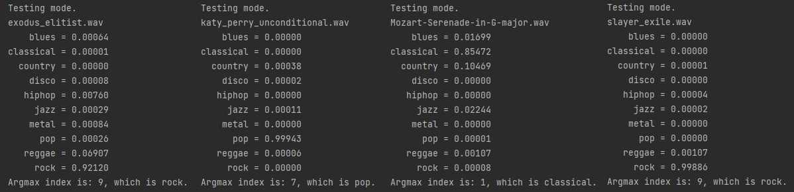

# Music genre classification

A personal project that aims to identify the genre of music presented in a given audio file. 
The classification is based on feeding a Mel Spectrogram of an audio to a convolutional neural network (CNN), which outputs the probabilities of each genre.
The implementation goal is to write an audio processing module, neural net module using pytorch and train the CNN to achieve decent classification of 10 genres on GTZAN dataset.
After that, create a personal dataset with 5 genres and compare the results.

## Audio processing module

Audio processing module is in soundtools.py file. It contains static methods to gradually convert an audio in WAV format to a Mel spectrogram, 
which will be fed to a CNN.
It allows you to cut, overlay, re-channel and oversample the audio. There are also some methods to augment the data with time shifting or spectrum shading.

## Dataset and CNN modules

Dataset class implements methods that will be used by a torch DataLoader, such as getitem() and getlen(). 
File model.py contains an implementation of a 5-layer CNN using pytorch.

## The idea behind classification

- The classification is done on three-second one-channel .WAV tracks, so every training and validation audio needs to be converted to a mono signal and 
fit to 3 seconds either by padding or cutting. Then, the Mel spectrogram is extracted from the signal and possibly augmented by shading or shifting. This is how spectrograms look:

- All that remains is to classify these spectrograms as single-channel pictures, which is a basic thing to do with CNNs. The NN consists of 5 convolutional layers with BN, relu and maxpool, 
one fully connected layer and softmax at the end.
The cross entropy loss is used for backpropagation.
An accurate visualization of a used model is shown below:

## Results

Firstly, I trained my model on GTZAN dataset with 10 genres. The resulting network was performing well on validation data, which were taken from the same dataset. 
However, when giving it my own song, it often classified the song badly, i.e., metal was classified as reggae or rap. I came to a conclusion, that the GTZAN dataset consisted of 
really old songs with low quality signal and particularly in metal genre the audios are often live performances, where the noise is dominating over the song.
>Being a huge fan of metal music, this was unacceptable to me.

And that is why I decided to create my personal dataset with only 5 classes, 
which I gathered manually. Classification examples of 10 classes is shown below:

Reducing the number of genres to 5 and gathering my own dataset resulted in a much better performance. Here are some random classification results:

I visualized classification of 30 'never seen' test songs with a confusion matrix:

>To test the achieved results by yourself, drop desired tracks in .wav format to a testing_folder and run the train.py script.
>By default the program will take the first 3 seconds of each audio; you can prepare your own 3s tracks which represent i.e. the middle of a song.

And to end this README here is a loss progression during the training and a charmingly beautiful spectrogram I witnessed:

